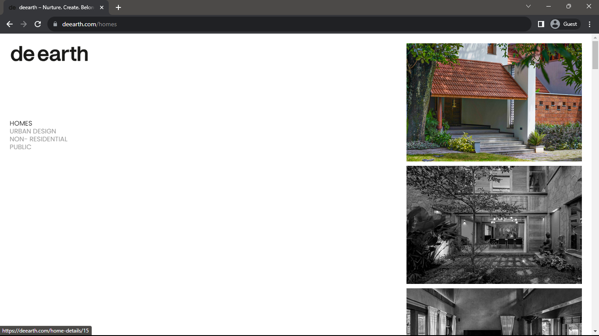
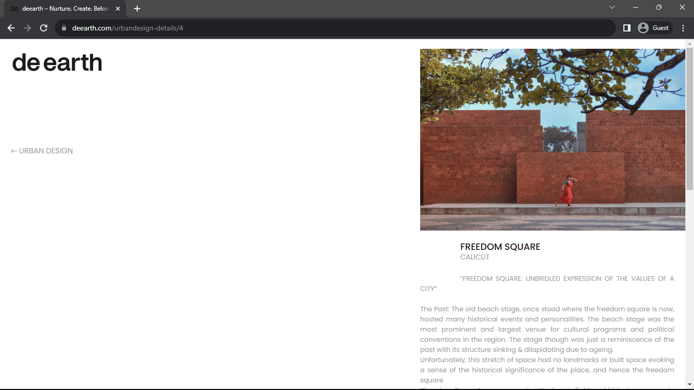
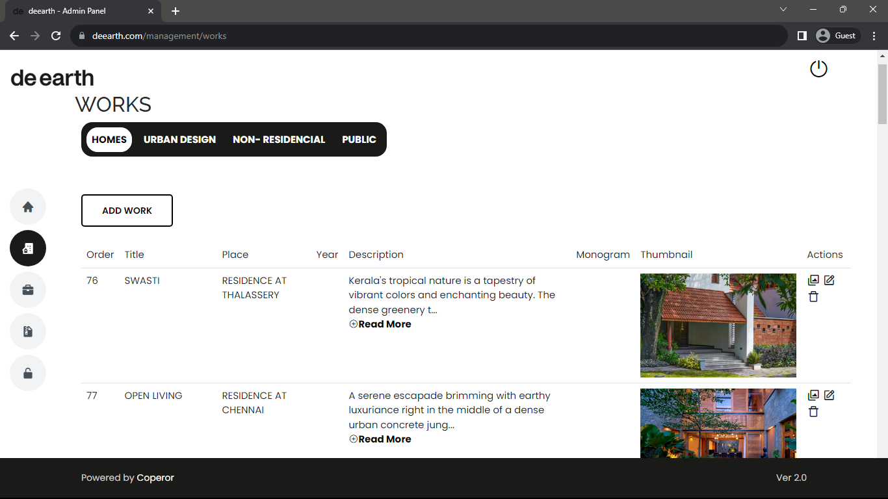
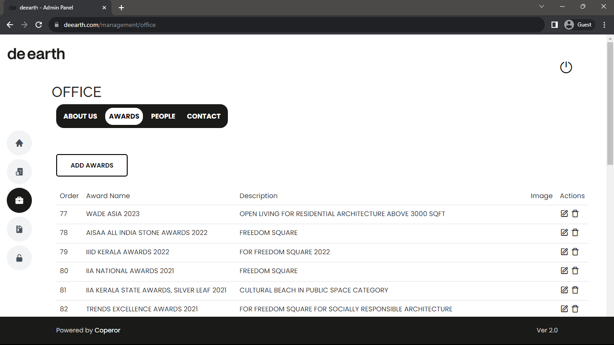
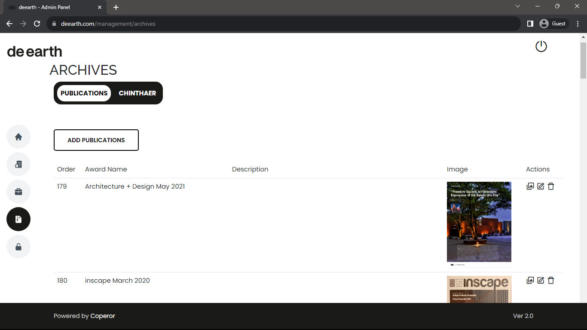

<h1 align="center">deearth Website</h1>

<h3>Project Description</h3>

Developed a dynamic website for an architectural firm, dearth utilizing the Laravel framework. Created the admin panel by implementing a comprehensive CRUD (Create, Read, Update, Delete) system for project descriptions, awards and employees listing, allowing seamless management of the firm's portfolio. Incorporated mailing system of laravel. Established relationships within the database to enhance data organization and retrieval, ensuring a streamlined and efficient user experience.

<a href="https://deearth.com">DeEarth Website</a>